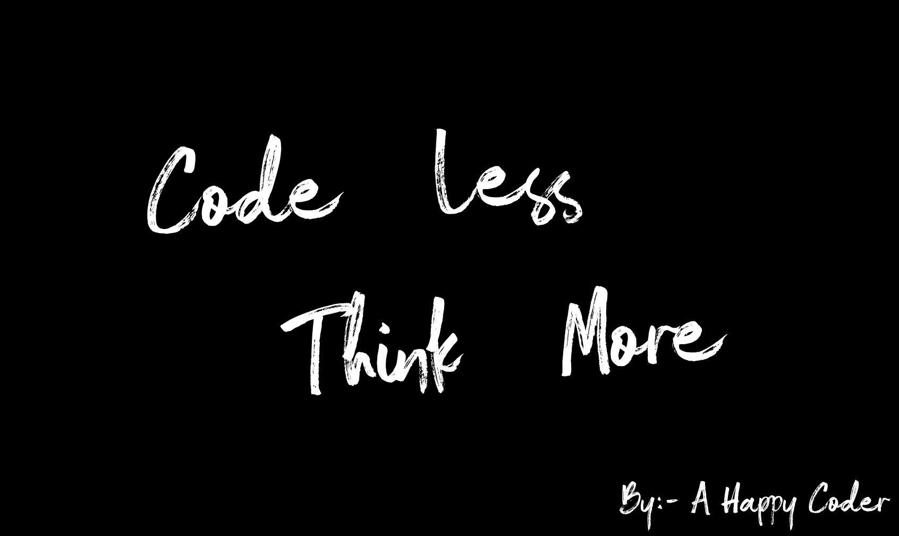

# HarshitChhipa.com

# Phases
    
    1 Design finalization and a simple proto with Adobe XD.
    
    2 Code base Architecture and Folder structuring and base setup

    3 I have broke down the UI in Component and will be creating components one by one.

# A THOUGHT

    Once a colleague said 

